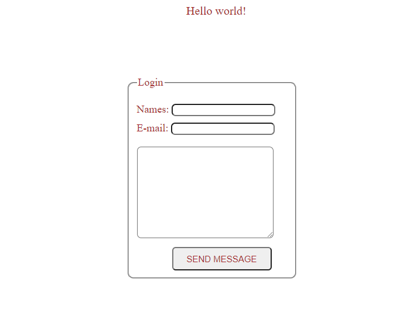

# Microverse - Week 1 Hello World

This is a simple hello world project that shows how to set up linters and use github workflows.

Test Project

# Built With

HTML and CSS
Introducing Linters
- Sytle Lint
- WebHint
- Lighthouse
 
Live demo

👤 Authors

👤NSABIMANA Emmanuel
- GitHub: [@emmyn5600](https://github.com/Emmyn5600)
- Twitter: [@NSABIMA62253884](https://twitter.com/NSABIMA62253884)
- LinkedIn: [@nsabimana-emmanuel-4276091b2](https://www.linkedin.com/in/nsabimana-emmanuel-4276091b2/)

👤Joshua Ivie
- GitHub: [@joshuaivie](https://github.com/joshuaivie)
- Twitter: [@joshuaivie_](https://twitter.com/joshuaivie_)
- LinkedIn: [joshuaivie](https://linkedin.com/in/joshuaivie)

# 🤝Contributing

Contributions, issues, and feature requests are welcome!

Feel free to check the issues page. Show your support

Give a ⭐️ if you like this project!

# Acknowledgments

- Hat tip to anyone whose code was used
- Inspiration
- etc

# 📝 License 
This project is MIT licensed.